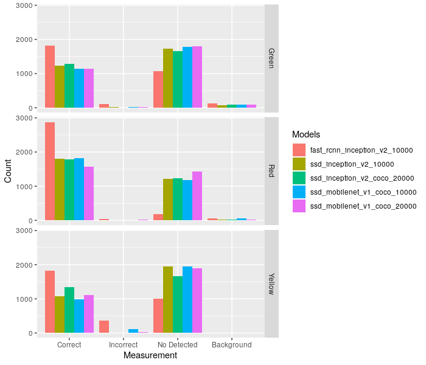
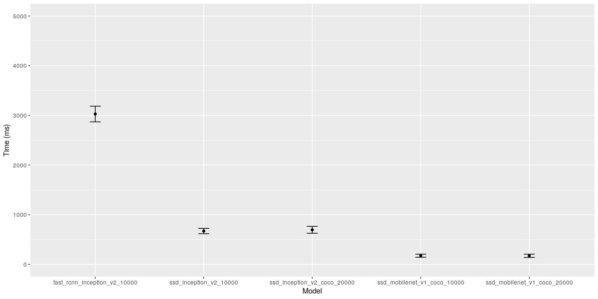
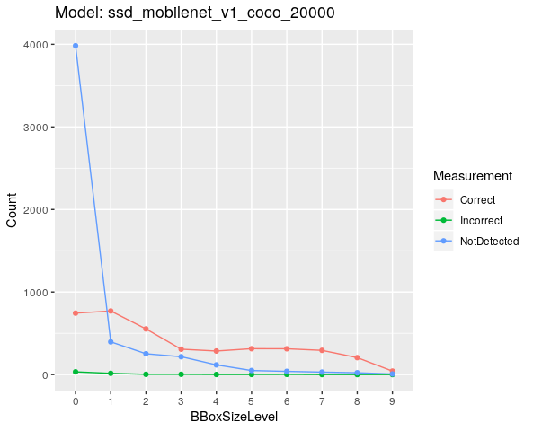

# Udacity SDC Engineer - Capstone Project

### Team Fast and Furious: Carla Drift

#### Team members
- Gleb Podkolzin (lead)
- Ajith Raj
- Allen Hsu
- David Altimira
- Ming Wong

# General approach

We started by implementing a waypoint updater based on walkthrough lectures. The waypoint updater publishes at a
 frequency of 50hz. At every cycle, we send some maximum number of waypoints ahead of the car to the `final_waypoints
 ` publisher.

Each waypoint includes a target velocity value. When there is no stopline nearby, we simply publish these waypoints
 as given. However, if there is a stopline the car must obey, we gradually bring the target velocity of the car down
  to `0` to make sure the car stops before the stopline waypoint.

A `camera_info` publisher publishes the current camera image to the `/image_color` topic at 10hz. We subscribe to
 `/image_color` inside the `tl_detector` node and cache the current image received. The goal of `tl_detector` is to
  perform the necessary image processing and publish the next stopline. We do this at a frequency of 10hz as well.
  Additionally, we run the most recent available camera image through a neural network (described below) to detect
   any traffic lights with their status.

Since the neural network takes longer than 100msec (processing speed needed to maintain a constant 10hz) to return
 results, at every cycle we set a boolean to keep track of when we are currently processing an image. As a result
 , each detection cycle uses the latest image and there is less chance of lag due to triggering a new cycle of traffic light
   detection before the previous one completes, causing a series of stale results messing up the car behavior.

For each detected traffic light state, we use a couple techniques to filter out possible noise:

- Only using detections with a confidence level higher than `0.5`
- Waiting until we identify the same state at least 2 times before updating the prediction

 Both of these techniques guard against unpredictable behavior due to errors in detection. For the second method, 2
 was a number chosen to balance confidence in the prediction with reacting quickly enough to changing conditions.

Another byproduct of slow detection speeds is the possibility of the car seeing a yellow light and
 interpreting it too slowly, allowing the light to turn red and causing the car to run the red light. With 2 cycles to
 update predictions, the worst case is ~3 detections, because the light can change in the next frame after the
 previous cycle of detection kicked off.

To solve this, we assume the next stopline applies unless either:
- we see a `green` light or
- we identify a `yellow` light and we are close enough to it to exclude the possibility of the light turning red
 before we cross the line.

This ensures that in the worst case scenario, the car will always stop at the next stopline (assuming it is not mis
-detecting red lights as green).

### Future work

# Traffic light detection

For an autonomous car it is important to detect the traffic lights so that the car can adjust its speed based on the
 light's state: red, green or yellow. For example, when the car navigates across different waypoints, the car might want to travel at its maximum speed. However, as soon as it detects a red light, it should reduce the speed (and stop). This is done by adjusting the waypoints' speed.

To detect the traffic lights,  the system (and in particular the Perception module) should have a model that can detects correctly traffic lights and its state (red, yellow or green). Furthermore, apart from a high degree accuracy (as a detection error could cause a car accident), the traffic light classifier might need to run fast, i.e. be efficient.

## Models and architectures

There are different models and architectures we considered for the traffic light detection.

- Faster-rcnn: this is a type of architecture/model that have two training phase. First it has a region proposal network to obtain the region of interest and finally there is a classification network.
- SSD (Single Shot Detection) architecture: Instead of having a two training phase, this type of architecture have just one training phase. Therefore, this architecture can be trained end-to-end.

Also, there are implementation of neural networks that are optimized to run efficiently. These are named MobileNets, which are are neural networks that can run efficiently and can therefore meet the efficiency requirement.

Our approach was to reuse existing models from the TensorFlow detection model zoo [2]: collection of detection models pre-trained on different datasets on the task of object detection. These pre-trained models would be our starting point and we will re-train these models with our dataset generated for our training.

The different models we aimed to re-train and evaluate their accuracy and performance were:

- ssd inception v2 coco.
- ssd mobilenet v2 coco.
- faster rcnn inception v2 coco

### Methodology approach taken

- Train the different models in a simulation data set.
- Evaluate accuracy and speed for each of these models.
- Select a model.
- Check how we could improve the model selected.
- Train the same model for the site data.
- Freeze and export the graphs of both models (one for the simulation and the other for the real site). The exported graphs will be the ones to be used in the simulated and real vehicle.

### Settings of the models

Each model has a particular settings (.config file) that we needed to tune. The different parameters that we adjusted:

- Model:
  - Adjust the number of classes to 4 classes.
  - max_detection_per_class (100) and max_total_detections (300) to 10 and 10 respectively.
- Train_config:
  - find_tune_checkpoints: directory where the pre-trained model is placed.
  - Number steps: 10000/20000.
- Eval_config:
  - num_examples: number of images in the evaluation data.
- Eval_input_reader and train_input_reader:
  - input_path and label_map_path to the .record files and label_map_pbtxt respectively.

## Datasets

The collection of datasets was one of the most fundamental tasks. A dataset which contains the necessary features along with different augmentations helps the model
to increase the model accuracy. Some characteristics of good dataset are listed below:

1. Data should be well balanced ie., similar amount of sample data should be available for different classes to
 classify (red, green and yellow traffic light images)
2. Dataset should contain same data from different parameter combinations. (Traffic light images should be taken from all distances ie., too close to far away distances)
3. Data should be augmented using different techniques like Horizontal/Vertical Orientation, Rotation, Brightness, Zoom etc.
4. Additional augmentation techniques includes adding good quality synthetic images which can help the model achieve a higher degree of generalization[2].

### Simulation data

We used two different datasets. For training the models we used an external one [3]. For evaluating the model, we
 created another dataset that was generated with a script. This script consisted in taking random background images,
 and placing random number of traffic lights (red, green or yellow) at random positions and with some transformations
 such as rotation or scaling.

### Site data

## Results of the model analysis

### Models trained with simulator data

We used different models with different steps and we evaluated the performance based on the four categories (see below picture):
- Correct: If the traffic light is detected and labelled correctly.
- Incorrect: If the traffic light is detected and labelled incorrectly.
- No Detected: If the traffic light is not detected.
- Background: If we detect a traffic light on a background.

As we can see in the picture the fast_rcnn_inception_v2 with 10000 steps performed better than the other models. The rest of the models performed similarly. We can also observer that there were very few traffic lights that were detected incorrectly but there were quite a few traffic lights not detected.

We also measured the efficienty (i.e. the amount of time each model took to process and evaluate each image).

We can see that the fast_rcnn_inception_v2 was quite slow and the fasted model was the ssd_mobilenet. Although the fast_rcnn was the more accurate, we decided to discard this model owing to its slowness. Since all the other models performed similary, we chose the ssd_mobilenet_v1_coco_20000 as our model.

To further analyse the selected model, we also decided to evaluate its performance for different traffic light sizes. This could inform whether the model detected better some traffic light sizes than others and thus inform how to best retrain the model with new data.

We decided to have 10 categories of bounding boxes sizes. To obtain the range of traffic light sizes for each category, we calculated the maximum size and the minimum size of the traffic lights. Then, the size was obtained by first calculating the range of sizes for each category `$range_size=\frac{(max_size-min_size)}{10}$`. So the first category in the graph (category 0) had the following range of traffic light size: `[min_size, min_size+range_size]`. The last category had `[max_size-range_size, max_size]`.

 

 We can see that the model performed very well in detecting correctly the traffic lights. However, we can see that for very small traffic lights, the model had some problems in detecting them. This could also explain why we have seen quite a few traffic lights undetected. One explanation for this is that our evaluation script produced too small traffic lights that the model was not trained for. We did not consider this as a big concern as if we miss a traffic light that is further away from the car, this would not cause any problem as long as we detect it as we get closer.

### Site model

### Methodology to generate datasets

The Simulator images were collected by directly running the vehicle in the Simulator environment. The images collected were then labeled using the open source tool labellmg.[4]
The XML labels were then used to create a csv file containing all the input image and their respective label details.[6] Once the csv file was generated, it was converted into TFRecord format, as that is the label input for the model training. [5]

####  Data augmentation

# Future work
- Train the model with smaller traffic lights so that we do not miss these traffic lights in our detection.

# References

[1] [https://anyverse.ai/2019/06/19/synthetic-vs-real-world-data-for-traffic-light-classification](https://anyverse.ai/2019/06/19/synthetic-vs-real-world-data-for-traffic-light-classification)
[2] [https://github.com/tensorflow/models/blob/master/research/object_detection/g3doc/detection_model_zoo.md  ](https://github.com/tensorflow/models/blob/master/research/object_detection/g3doc/detection_model_zoo.md  )
[3] [https://github.com/alex-lechner/Traffic-Light-Classification#linux](https://github.com/alex-lechner/Traffic-Light-Classification#linux)
[4] [https://github.com/tzutalin/labelImg](https://github.com/tzutalin/labelImg)
[5] [https://github.com/datitran/raccoon_dataset](https://github.com/datitran/raccoon_dataset)
[6] [https://pythonprogramming.net/creating-tfrecord-files-tensorflow-object-detection-api-tutorial  ](https://pythonprogramming.net/creating-tfrecord-files-tensorflow-object-detection-api-tutorial  )
